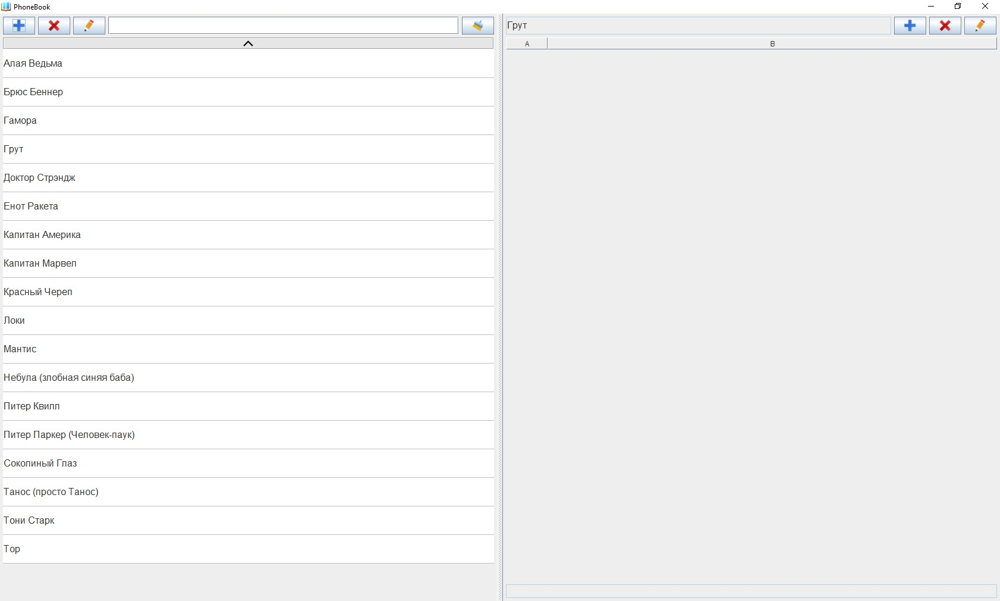
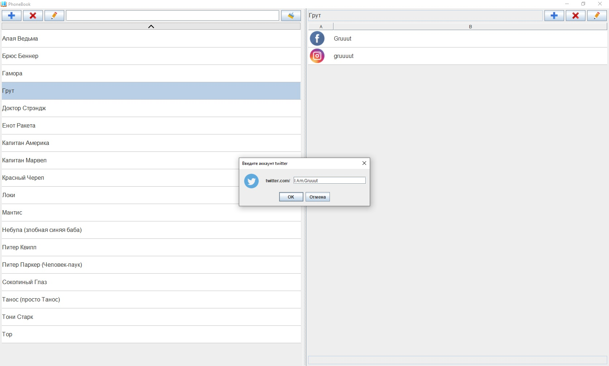
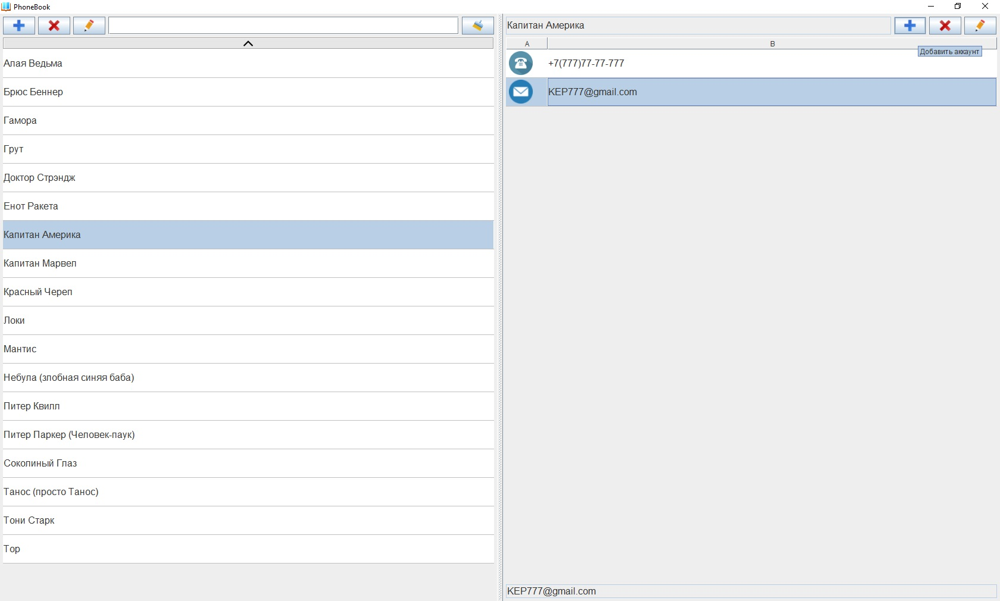
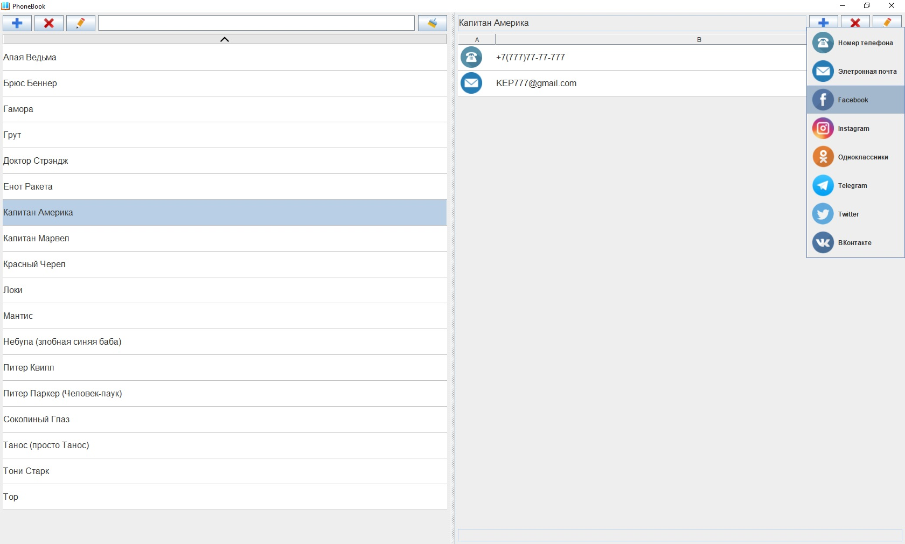

# PhoneBook

Телефонная книга. Данный проект - первая моя попытка написать приложение, использующее базу данных и SQL для работы с ней. 
В качестве СУБД выбрано простое решение - SQLite. Использование чего-то большего для столь небольшого приложения было бы нерациональным.
Приложение позволяет хранить данные не только о телефонных носерах, но и об аккаунтах электронной почты и различных соцсетей.
Поддерживается быстрый поиск по контактам (без учета регистра символов).

Состав классов следующий:

1. MainClass - запускает приложение. Создает ссылки на компоненты доступа к данным.

2. DataBaseConnector - служит посредником между компонентами интерфейса и базой данных. Создает подключение к БД и выполняет запросы
   на доступ к данным.

3. ResourceLoader - загружает графические ресурсы приложения (иконки) и позволяет другим классам получать их уже в виде ссылок на
   объекты Image или ImageIcon.

4. GUI - создает окно приложения и располагает в нем основные компоненты - панель контактов и панель аккаунтов.

5. AccountTypes - перечисление типов аккаунтов, которые может хранить программа.

6. ContactsPane - компонент, предназначенный для работы с контактами. Содержит методы, необходимые для добавления, удаления, редактирования
   контактов.

7. AccountsPane - компонент, предназначенный для работы с аккаунтами выбранного в данный момент контакта.

Скриншоты приложения ниже:

